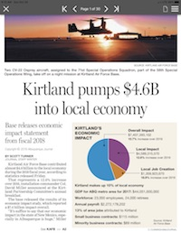

# VisLies 2019 Gallery

October 22, 2019

We had another fun year at VisLies.
We were given a bigger room this year, which was good since we had a lot of
attendance.
Once we got through the locked doors we were treated with some good bad vis.

## The Sum is more than its Parts

[Ken Moreland] kicked things off with an illustrative example of a VisLie using a figure [from an article][Kirtland Article] that was published in [his local paper][Albuquerque Journal] the previous weekend.
The article is a report on the positive effects of the local US Air Force Base on the local economy.

The information is, as far as we know, correct.
But look more closely at the pie chart.
Something is odd.
The blue slice is labeled "Overall Impact" and the purple slice is labeled "Local Impact."
Wait a minute.
Wouldn't "Local Impact" be a part of "Overall Impact?"
Yes, it would.
The whole metaphor for a pie chart is broken.

The blue region should be the whole of the pie (by definition).
The purple region should be a subset of the purple region.
To make matters worse, the mistake is recursive.
The orange wedge, "Local Job Creation," is actually a subset of the purple section.

The dumbest part of all this is that the VisLie is working against the point that the article is trying to make.
The point of the article is that the Air Force Base has a positive monetary effect on the local economy.
Over half the spending goes to the local economy, but this pie chart makes it look like about a third of the spending is local.

## A Flattened Earth

Next, [Ken][Ken Moreland] talked about flat Earth.
Well, not literally flat Earth, but rather what happens when you flatten the Earth to a map.
The most common way of flattening the whole Earth to a map is the Mercator projection, as shown here.
Don't get us wrong, there are lots of valid reasons to display the topology of the Earth in this way.
But ultimately the Earth is not a rectangle.
It is a sphere.
This representation is lying to you.

Consider some of the most egregious lies.
Greenland looks huge.
Maybe all that land area is extremely undervalued?
No, Greenland is not really as large as it looks in this map.
(It is also not for sale.)

Likewise, Africa does not look that large in this plot.
But in actually, Africa is huge.

I mean, seriously, it is HUGE.
Consider [this demonstration by Kai Krause] showing Africa containing true projections of several other countries.
Africa has enough land mass to contain the United States AND India AND China AND Europe AND Japan all at the same time!
Even understanding the distortions of the Mercator projections, it's hard to resolve this size in the image.

As problematic comparing the relative size of landmasses can be, there can be much larger consequences.

Consider this map used in an article titled "[When bluff turns deadly]" in _The Economist_ (May 1, 2003).
The map (nominally) shows the potential range of missiles launched from North Korea.
It shows the potential range of hitting targets as far as Hawaii and Alaska given the development of appropriate missile technology.

Except some observant readers noted that the range looks wrong.
A circular region on the spherical globe is not circular on a Mercator projection.
The graphic designer has apparently just drawn circles on the Mercator projection and has apparently gotten it wrong.

So _The Economist_ revisited the graphic and issued [this correction][economist correction].
The actual danger is much greater than was originally suggested by the Mercator projection.
Whereas before the longest range missiles did not appear to reach the western U.S. coast, the actual range covers the entire United States.
(Props to Sara Lafia, UCSB for pointing this out in a [June 2017 letter to the Santa Barbara Independent]).

[Ken Moreland]: http://kennethmoreland.com

[Albuquerque Journal]: https://www.abqjournal.com
[Kirtland Article]: https://www.abqjournal.com/1380415/kirtland-pumps-46b-into-local-economy.html
[this demonstration by Kai Krause]: https://www.dailymail.co.uk/news/article-2445615/True-size-Africa-continent-big-China-India-US-Europe-together.html
[When bluff turns deadly]: https://www.economist.com/special-report/2003/05/01/when-bluff-turns-deadly
[economist correction]: https://www.economist.com/asia/2003/05/15/correction-north-koreas-missiles
[June 2017 letter to the Santa Barbara Independent]: https://www.independent.com/2017/06/14/map-rap/
