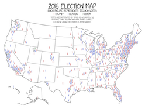

# VisLies 2019 Gallery

October 22, 2019

We had another fun year at VisLies.
We were given a bigger room this year, which was good since we had a lot of
attendance.
Once we got through the locked doors we were treated with some good bad vis.

## The Sum is more than its Parts

[Ken Moreland] kicked things off with an illustrative example of a VisLie using a figure [from an article][Kirtland Article] that was published in [his local paper][Albuquerque Journal] the previous weekend.
The article is a report on the positive effects of the local US Air Force Base on the local economy.

The information is, as far as we know, correct.
But look more closely at the pie chart.
Something is odd.
The blue slice is labeled "Overall Impact" and the purple slice is labeled "Local Impact."
Wait a minute.
Wouldn't "Local Impact" be a part of "Overall Impact?"
Yes, it would.
The whole metaphor for a pie chart is broken.

The blue region should be the whole of the pie (by definition).
The purple region should be a subset of the purple region.
To make matters worse, the mistake is recursive.
The orange wedge, "Local Job Creation," is actually a subset of the purple section.

The dumbest part of all this is that the VisLie is working against the point that the article is trying to make.
The point of the article is that the Air Force Base has a positive monetary effect on the local economy.
Over half the spending goes to the local economy, but this pie chart makes it look like about a third of the spending is local.

[Albuquerque Journal]: https://www.abqjournal.com
[Kirtland Article]: https://www.abqjournal.com/1380415/kirtland-pumps-46b-into-local-economy.html

## A Flattened Earth

Next, [Ken][Ken Moreland] talked about flat Earth.
Well, not literally flat Earth, but rather what happens when you flatten the Earth to a map.
The most common way of flattening the whole Earth to a map is the Mercator projection, as shown here.
Don't get us wrong, there are lots of valid reasons to display the topology of the Earth in this way.
But ultimately the Earth is not a rectangle.
It is a sphere.
This representation is lying to you.

Consider some of the most egregious lies.
Greenland looks huge.
Maybe all that land area is extremely undervalued?
No, Greenland is not really as large as it looks in this map.
(It is also not for sale.)

Likewise, Africa does not look that large in this plot.
But in actually, Africa is huge.

I mean, seriously, it is HUGE.
Consider [this demonstration by Kai Krause] showing Africa containing true projections of several other countries.
Africa has enough land mass to contain the United States AND India AND China AND Europe AND Japan all at the same time!
Even understanding the distortions of the Mercator projections, it's hard to resolve this size in the image.

As problematic comparing the relative size of landmasses can be, there can be much larger consequences.

Consider this map used in an article titled "[When bluff turns deadly]" in _The Economist_ (May 1, 2003).
The map (nominally) shows the potential range of missiles launched from North Korea.
It shows the potential range of hitting targets as far as Hawaii and Alaska given the development of appropriate missile technology.

Except some observant readers noted that the range looks wrong.
A circular region on the spherical globe is not circular on a Mercator projection.
The graphic designer has apparently just drawn circles on the Mercator projection and has apparently gotten it wrong.

So _The Economist_ revisited the graphic and issued [this correction][economist correction].
The actual danger is much greater than was originally suggested by the Mercator projection.
Whereas before the longest range missiles did not appear to reach the western U.S. coast, the actual range covers the entire United States.
(Props to Sara Lafia, UCSB for pointing this out in a [June 2017 letter to the Santa Barbara Independent]).

[this demonstration by Kai Krause]: https://www.dailymail.co.uk/news/article-2445615/True-size-Africa-continent-big-China-India-US-Europe-together.html
[When bluff turns deadly]: https://www.economist.com/special-report/2003/05/01/when-bluff-turns-deadly
[economist correction]: https://www.economist.com/asia/2003/05/15/correction-north-koreas-missiles
[June 2017 letter to the Santa Barbara Independent]: https://www.independent.com/2017/06/14/map-rap/

## A Really Flat Earth

So, speaking of flat earth representations, [Ken][Ken Moreland] thought it would be funny to poke fun at the [Flat Earth Society].
This is an organization of people who legitimately and literally think that the earth is flat.
It's curious what kind of data such an organization presents to justify such a ridiculous conclusion.
[Ken][Ken Moreland], after spending a ridiculous amount of time browsing through the [Flat Earth Society's Wiki], reports that the answer is, not much.
The data displays seem to fall into 2 categories: unsubstantiated diagrams and misappropriated data.

### Unsubstantiated Diagrams

Many of the articles on the [Flat Earth Society's Wiki] contain diagrams that demonstrate the geometry of a particular point.
However, no evidence is provide to show that the diagram is correct.
The point seems to be we drew it because it is right and it is right because we drew it.

Consider this diagram of a sun (and moon) floating over a disk earth.
This is presented to explain [time zones on the flat earth].
I suppose in some alternate universe (with completely different laws of physics) this could exist, but absolutely no evidence is provided to support any of this.
Rather, the very fact that this drawing exists seems to be the evidence that the sun hovers in circles around the earth.

There is so many things wrong with this idea.
Why do we see the sun/moon come up over the horizon instead of laterally like a helicopter spotlight?
(Apparently, [perspective makes everything look like its on the horizon] no matter how high it is.)
How does the moon move to give the different phases?
If the sun is a sphere (like the [Flat Earth Society agrees it is][sun is a sphere]) why does it act like a spotlight?
Why is the light shine in an oblong instead of circular shape?
Why don't the sun and moon come crashing down to the Earth?

Yet, we are supposed to ignore (or lamely explain away) all these issues with no evidence simply because we drew it.

### Misappropriated Data

Of the remaining (scarce) visual displays on the [Flat Earth Society's Wiki], the majority fall into the category of misappropriated data.
The displays come from a third party that constructed them for an entirely different reason.
The visualizations are then taken used for an argument that is completely unsubstantiated by the data.
Displaying a visualization next to an argument to give credence even though the data does not substantiate the argument is [a lie we have seen before].
To be fair, the arguments here do directly address the data in the visualizations, but the conclusions drawn radically exceed what is presented.

Consider this [discussion on submarine cables].
The "evidence" presented is that laying undersea cables requires more cables than calculated due to a "misunderstanding of the Earth's shape."
To support that conclusion, this map of submarine cables is presented (originally constructed by [TeleGeography's Submarine Cable Map]).
The observation presented is that there are fewer cables lain in the southern hemisphere than the northern hemisphere.
The reason inferred by the Flat Earth Society is because they contend the size of (what us "round Earther's call") the southern hemisphere, so cables lain in the northern hemisphere can be shorter and cheaper.

This explanation, of course, completely ignores lots of much more rational reasons why the northern hemisphere has more cables.
The most obvious reasons stem from the fact that [about 90% of the world population is in the northern hemisphere], so it makes complete sense that more communication cables would be required in the northern hemisphere.

Another example of incorrect conclusions from visualizations can be found in this [discussion attempting to discredit the Coriolis effect].
In it, the article presents this plot from an 1803 experiment.
The experiment involved dropping pebbles down a deep (90 meter) mine shaft.
Because the mine shaft is so deep the tangential velocity of the Earth's rotation, which is proportional to the distance to the rotational axis, is slightly slower at the shaft bottom.
Thus, a dropped pebble's motion will veer to the East relative to the mine shaft.
The plot here shows the predicted and measured landing of the pebbles.

The data do show a deflection in the predicted direction, but the Flat Earth Society has issues with it.
They note an "Eastwards concentration of pebbles between 20 and 30 units."
There is a bit of confusion between accuracy and precision here, as there are also clusters on the Westward side.

Still, does the Flat Earth Society have a point about the experiment being too inaccurate to properly demonstrate the Coriolis effect?
Perhaps.
The reproduction is too hard to tell for sure.
(This figure was taken from a [2003 article from Anders Persson], which reproduces the figure from a [1912 book by Johann Hagen], which came from we don't know how many reproductions from the original experiment.)
The fact of the matter is that, due to its size, the Earth's Coriolis effect is small and directly measuring the Earth's Coriolis effect is difficult.

[The Flat Earth Society article][discussion attempting to discredit the Coriolis effect] states, "Picking any few tests as evidence of the Coriolis Effect would be fallacious."
These are strong words coming from someone who is literally cherry picking experiments to point out imprecision in 200-year-old measurements.
The article claims, "Unlike other science cornerstone experiments, which have been repeated by classrooms, laboratories, and research groups for hundreds of years, these experiments were dropped from classroom and scientific interest."
This statement is patently untrue.
Experiments measuring the Coriolis effect are constantly ongoing, most notably in many installations of [Foucault pendulum]s.

[Flat Earth Society]: https://www.tfes.org
[Flat Earth Society's Wiki]: https://wiki.tfes.org/The_Flat_Earth_Wiki
[time zones on the flat earth]: https://wiki.tfes.org/Flat_Earth_-_Frequently_Asked_Questions#How_do_you_explain_day.2Fnight_cycles_and_seasons.3F
[perspective makes everything look like its on the horizon]: https://wiki.tfes.org/High_Altitude_Horizon_Dip
[sun is a sphere]: https://wiki.tfes.org/The_Cosmos#The_Sun
[a lie we have seen before]: http://www.vislies.org/2016/gallery/#unsupported-conclusions
[discussion on submarine cables]: https://wiki.tfes.org/Undersea_Cables
[TeleGeography's Submarine Cable Map]: https://www.submarinecablemap.com
[about 90% of the world population is in the northern hemisphere]: https://www.businessinsider.com/90-of-people-live-in-the-northern-hemisphere-2012-5
[discussion attempting to discredit the Coriolis effect]: https://wiki.tfes.org/Coriolis_Effect#Schlebusch_Drop_Plot
[2003 article from Anders Persson]: https://rmets.onlinelibrary.wiley.com/doi/pdf/10.1256/wea.141.02
[1912 book by Johann Hagen]: https://www.abebooks.co.uk/Rotation-Terre-preuves-mécaniques-anciennes-nouvelles/10045352902/bd
[Foucault pendulum]: https://en.wikipedia.org/wiki/Foucault_pendulum

## Honorable Bar Charts

[Guan-de Wu] provided this quick capture from a presentation from HUAWEI, a mobile phone company in China.

This photo shows a shot of a HUAWEI presentation on HONOR Play, a rendering product for its mobile phones.
The bar chart on the slide for this presentation is showing how HONOR Play renders faster than its competitor.
Taller bars, which are ostensibly representing frames per second (FPS), represent better performance.
The measured numbers do show better performance with HONOR Play, but the lengths of the bars is less than honest.

A closer inspection reveals that the lengths of the bars are not
commensurate with the relative performance.
To exaggerate the difference, the designers of the plot set the y axis bottoms at a non-zero value, which make the difference far larger than the real difference.
For example, in the second chart, HONOR Play is 57.1 FPS and its competitor is 51.5 FPS, which makes HONOR Play about 11% faster.
However, the chart looks like the FPS of HONOR Play is more than 4 times that of
its competitor.

Here is a corrected version of the same plot.
As you can see, the difference between the two rendering systems is not nearly as dramatic as initially portrayed.

## Impeachable Geography

[David Borland] presented this image featured in a recent tweet from U.S. President Donald Trump.
The point of this image is to show the overwhelming support for the president based on the results of the last election.
Red represents counties that voted for Trump whereas blue represents those counties that voted for his opponent, Hillary Clinton.
The majority of the United States is covered red.
Looks like most of America supports (or at least supported) Donald Trump, right?

Well, no.
[Donald Trump was not elected by a landslide.]
(In fact, if U.S. elections used the popular vote, he would have lost.)
Clearly there must be something misleading about this map.
One problem oft pointed out is that [the data is not quite correct].
However, the difference is pretty subtle, visually.
[The corrected data] looks pretty much the same.

The problem is that this type of visualization, technically called a [choropleth map], has a known issue of the variable being represented getting confused with the area they are attached to.
The population density varies greatly across the United States.
Those people located rural areas have a greater area associated to them than people in urban areas.

This map demonstrates the problem.
In it, the regions of the map colored in blue contain half of the population of the United States, and the gray regions contain the other half.
Yet, the gray overwhelms to visualization.

This is why Trump's election map looks so overwhelmed with red.
Many of Trump's supporters reside in rural areas.
So these large areas of Trump supporters actually contain fewer people than the urban areas of Clinton supporters.

Unfortunately, there is no straightforward fix to this problem.
Several techniques exist and have been applied to this data.
Here is a solution [presented by Larry Weru for STEM Lounge].
This visualization corrects the original choropleth by altering the colors in two important ways.
First, rather than showing the colors with a full blue or red, the colors are adjusting on a scale from blue to gray to red based on the margin of victory.
Close races are colored more gray whereas regions that are very red or blue are stronger wins.
Second, areas with sparse populations are represented with muted colors.
In this way the colors more accurately represent the real support for each candidate.

Another approach is to avoid filling the space with colors.
Instead, the data (in this case, votes) are represented with dots or some other glyph.
This is what is done in [this map featured in xkcd].
As we can see, densely populated areas have a lot of color whereas sparsely populated areas have empty space.

[Donald Trump was not elected by a landslide.]: https://en.wikipedia.org/wiki/2016_United_States_presidential_election
[the data is not quite correct]: https://www.cnn.com/2019/10/01/politics/trump-impeach-this-map-fact-check/index.html
[The corrected data]: https://drive.google.com/open?id=18DofUCkWJ4YFbx3heE2MVc63wbV4RDBx
[choropleth map]: https://en.wikipedia.org/wiki/Choropleth_map
[presented by Larry Weru for STEM Lounge]: https://stemlounge.com/muddy-america-color-balancing-trumps-election-map-infographic/?v=2
[this map featured in xkcd]: https://xkcd.com/1939/

## When the Truth is a Lie

[Roy Ruddle] presented this conundrum.
Consider these two bar graphs that are supposed to be showing the same data.
The values for variables A through E are 0, 1, 5,000,000, 9,999,999, and 10,000,000, respectively.
Which of these bar charts is the best representation?

The bar chart at the left is an honest representation.
The length of the bars are linearly scaled with respect to the variable.

The issue comes in with variables B and D.
The length of B should be 1 ten-millionth the size of the full bar, which is much less than the size of a pixel and is thus not visible.
Likewise, the length of D is indistinguishable from the full bar.

From a statistical standpoint, this makes sense.
A 1 in 10,000,000 occurrence is so rare as to be statistically insignificant.
However, in practice that rare occurrence can be critically important, such as an event that causes people to die.
In such a case, alerting the viewer to the fact that rare occurrences happen is important.
In this case, the bar chart to the right is better.
The right bar chart uses a discontinuous scaling to make the first and last values visible.

This was the issue for some of [Roy's recent medical visualization work].
At issue was indicating values that were close to the minimum or maximum value.
As shown here, Roy used this trick of a discontinuous scaling at the ends of the range to indicate a small but important value.
Additionally, the visualization provides a second indication when a measurement is at its min (0%) or max (100%).

This is an example where vis truth or lie can get a bit fuzzy.
The most important part of a visualization is to provide the information that a viewer most needs.
Although these visualization are intentionally modifying the representation with respect to the data, a viewer with an appropriate understanding can get better information out of it.

[Roy's recent medical visualization work]: http://www.scitepress.org/DigitalLibrary/Link.aspx?doi=10.5220/0007354802300238

## I Speak What?

[Maria Zemankova] presented this visualization that, while perhaps not strictly a lie, definitely threw her through a loop.
The visualization associates most spoken languages with different countries.
But a quick glance shows some very strange values.
It has, for example, the U.S. associated with Chinese, Chile associated with German, and Germany associated with English.
Obviously, none of these are labels are the correct languages of these countries, which is [easily verified].

So what gives?
It could take a second or third look to find out.
If you go to [The Economist article featuring this graphic], you will see a bold title labeled "Un, deux, trois... parlez!"
That's probably not the most helpful text, even if you understand French.
But then read the less pronounced text below that.
This map gives the _third_ most spoken language, not the first most spoken.
Now this map makes a lot more sense.

Still, identifying countries by their third most spoken language is a strange thing to do by itself and out of context.
It is natural to assume that a single label next to a geographic region identifies the most predominant thing for that region.
Breaking assumptions like this should be done with care.

[The Economist article featuring this graphic]: https://www.economist.com/graphic-detail/2019/10/17/why-do-so-many-australians-speak-arabic
[easily verified]: https://en.wikipedia.org/wiki/List_of_languages_by_the_number_of_countries_in_which_they_are_recognized_as_an_official_language

[Ken Moreland]: http://kennethmoreland.com
[Guan-de Wu]: http://www.gdwu.xyz/about/
[David Borland]: https://renci.org/staff/david-borland/
[Roy Ruddle]: http://www.comp.leeds.ac.uk/royr/
[Maria Zemankova]: https://www.nsf.gov/staff/staff_bio.jsp?lan=mzemanko
