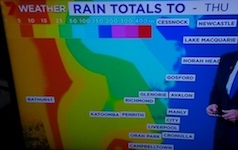

# VisLies 2019

<!--
**Tuesday October 24** 12:30 – 2:00 PM 
Held in conjunction with IEEE VIS 2019 
Estrel Hotel & Congress Center, Room 30310 
-->

This fun and engaging event showcases examples of egregious perceptual,
cognitive, and conceptual errors in visualization, presented by members of
the Vis community. Examples from our own work, from published papers, and
from the internet highlight the many ways the visual representation can
misrepresent the underlying phenomena in the data. This is a great
opportunity for amusement and for learning, and every year we walk away
with a smile on our faces and a deeper sense of responsibility that may
one-day impact the world.

## Call for Participation

VisLies is an open forum for anyone to present their favorite visual
misinformation. Make VisLies more fun for yourself and everyone else by
sharing your favorite (or most delpored) ways to misrepresent data.

### Scope

VisLies is looking for any examples of visualization examples or techniques
that take honest data and present them in ways that mislead or confuse the
viewer. We are looking for presenters to provide example visualizations,
produced from either others or themselves, that demonstrate how that
visualization deceives. These examples help teach us in an entertaining
way. Common examples of misleading visualizations and techniques include

  * Exaggerated scaling
  * Cherry picking data
  * Misusing and abusing color
  * Using features difficult to compare (like area or angle)
  * Misleading context or labeling
  * Inconsistent placement
  * Hiding with aggregation or highlighting outliers
  * Confusing 3D perspectives

The list goes on. Really, anything you find that detracts from the data is
fair game.

### Benefits

There are lots of great reasons to present at VisLies.

  * It's fun! No, seriously. Showing humours visualizations is a blast.
  * No peer review! It's so much easier than trying to get in any other VIS venue.
  * Be featured on our blog! We'll even place a link to your web site. Increase your rank on Google searches.
  * Get recognized by your peers! This is a great low barrier way to present at vis. (Great for students!)

### Submission

Becoming part of VisLies is easy. Simply send an email to
<a href="mailto:vislies2019@vislies.org">vislies2019@vislies.org</a> with
your name and a note that you want to present. That's it.

## Organization

Questions? Contact us at
<a href="mailto:vislies2019@vislies.org">vislies2019@vislies.org</a>.

|  |  |
| <a href="http://www.kennethmoreland.com/">Kenneth Moreland</a> | <a href="https://sites.google.com/site/bernicerogowitz/">Bernice Rogowitz</a> |
